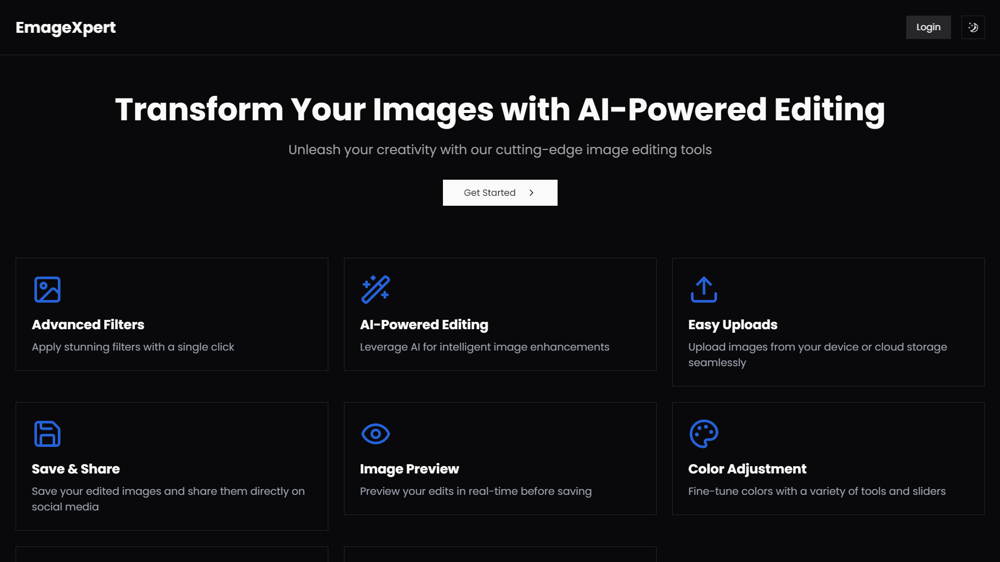
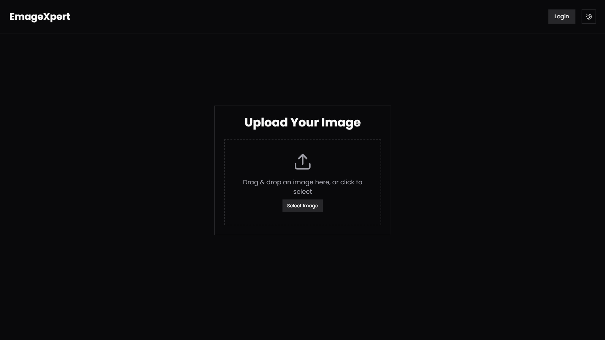
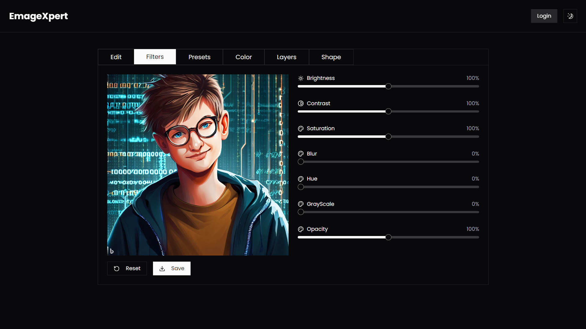

# EmageXpert

**EmageXpert** is a powerful, web-based image editor that enables users to upload images and apply various filters, text overlays, and customizable shapes directly in the browser. With an intuitive interface and essential editing tools, it offers a smooth and efficient image editing experience.



## Features

-   **Advanced Filters**: Apply various filters like brightness, contrast, saturation, blur, grayscale, and hue rotation.
-   **Text Overlays**: Add text or emojis to your images with customizable font size, color, and background.
-   **Shape Drawing**: Draw geometric shapes (rectangles, circles, triangles, ellipses, and lines) with customizable colors and sizes.
-   **Image Manipulation**: Rotate, flip (horizontally and vertically), and scale images.
-   **Multiple Export Formats**: Export your edited images in JPEG, PNG, or GIF formats.
-   **User-Friendly Interface**: Easy-to-use interface powered by Framer Motion for smooth animations.

## Installation

1. Clone the repository:

    ```bash
    git clone https://github.com/alok-x0s1/EmageXpert.git
    ```

2. Navigate to the project directory:

    ```bash
    cd EmageXpert
    ```

3. Install the dependencies:

    ```bash
    npm install
    ```

4. Run the development server:

    ```bash
    npm run dev
    ```

    The app will be available at `http://localhost:3000`.

## Usage

1. **Upload an Image**: Click the "Upload" button to select an image from your device or cloud storage.
2. **Apply Filters**: Use the slider controls to adjust brightness, contrast, saturation, hue rotation, blur, and more.
3. **Add Text**: Enter your text or emojis, select the text color and background, and position it on the image.
4. **Draw Shapes**: Select a shape, size, and color from the toolbar and place it on the image.

## Components

### Main Editor

-   **Image Upload**: Upload and display images.
-   **Canvas Manipulation**: Apply filters and draw shapes over the image.
-   **Text Overlay**: Input text and choose colors and background for text placement.

### Filter Functionality

-   **Brightness, Contrast, Saturation**: Adjust basic image settings with sliders.
-   **Hue Rotate, Blur, Grayscale**: Additional filters for creative adjustments.

### Shape Drawing

-   **Rectangles, Circles, Triangles, Ellipses**: Draw customizable shapes at the bottom of the canvas.
-   **Lines**: Draw straight lines with custom color and position.

## Built With

-   **Next.js**: React-based framework for server-side rendering and routing.
-   **Tailwind CSS**: Utility-first CSS framework for styling.
-   **Framer Motion**: Animation library for smooth transitions and effects.
-   **ShadCN**: UI components for a seamless user experience.

## Screenshots

Select image by clicking on button, or just drag and drop on this area.



Edit according to you


## Contributing

If you'd like to contribute to EmageXpert, feel free to submit a pull request or open an issue on GitHub.

1. Fork the repository.
2. Create a new branch for your feature or bugfix.
3. Submit a pull request with a detailed explanation of your changes.
